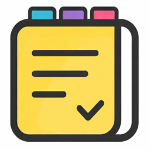

<div align="center">


<h1>NoteCards</h1>

**Notes. Flashcards. Mind Maps. Quizzes.**


</div>

---

**NoteCards** is a modern Windows desktop application designed to help you study more effectively. Write notes and instantly convert them into flashcards, mind maps, or quizzes using a **local AI model** — no internet connection required after the initial download.

## Why NoteCards?

Most learning tools either require an internet connection or charge extra for AI features. NoteCards runs **completely offline** after downloading the model once. All your data stays on your device. You get everything you need — from note-taking to AI-generated quizzes — in one clean, privacy-focused application.

## Screenshots

> *Screenshots will be added here.*

## Key Features

- **Notes** — Rich text editor with images, tags, groups, version history, and auto-save
- **Flashcards** — AI generates question-answer cards directly from your notes
- **Mind Maps** — AI creates hierarchical mind maps with 5 layout modes and rich node styling
- **Quizzes** — AI generates quizzes (SingleChoice / MultipleChoice / TrueFalse) with timers, hints, and attempt history
- **Light & Dark themes** with full English and Lithuanian language support

## Supported AI Models

NoteCards supports three local models you can choose from in Settings:
- **Qwen3.5-0.8B** — Fastest
- **Qwen3.5-2B** — Balanced
- **Qwen3.5-4B** — Most capable

The model is downloaded only the first time you use an AI feature — not on application launch.

## Architecture

NoteCards follows the **MVVM** (Model–View–ViewModel) architecture:

```
View (XAML / WPF)
    │ data binding
    ▼
ViewModel
    │
    ├── Models
    │   NoteDocument · FlashcardSetDocument · MindMapDocument · QuizDocument
    │
    └── Services
          ├── FlashcardConversionService ← AI → Flashcards
          ├── MindMapConversionService  ← AI → Mind Maps
          ├── QuizConversionService     ← AI → Quizzes
          ├── BundledModelHostService   ← Local LLM (user-selected)
          └── NoteFileService / AppSettingsService

Local JSON Storage (%LocalAppData%\NoteCards\)
```

All data is stored locally in: `%LocalAppData%\NoteCards\`

## Quick Start

**Requirements:** Windows 10/11 (64-bit), .NET 10, ≥ 4 GB RAM (8 GB+ recommended for AI features)

### Option 1: Download the executable (recommended)
Download the latest `NoteCards.exe` from the [Releases](https://github.com/Dovydo-Komanda/NoteCards/releases) page and run it.

### Option 2: Build from source
```bash
git clone https://github.com/Dovydo-Komanda/NoteCards.git
cd NoteCards
dotnet run --project NoteCards
```

## How to Use

1. Create a note and enter your content.
2. Click **Flashcards**, **Mind Map**, or **Quiz** — the AI will generate the material automatically.
3. During quizzes, use keyboard shortcuts: `1`–`9` to select an answer, `Enter` to proceed to the next question.

For complete documentation, visit the **[Wiki](../../wiki)**.

## Testing

The application was tested using manual functional testing. All major scenarios passed successfully. Detailed test cases and results are available in the [Wiki → Testing](../../wiki#4-testing-and-results).

## Team

| First Name | Last Name  |
|------------|------------|
| Mantas     | Gaižutis   |
| Jaunius    | Pigaga     |
| Rapolas    | Turauskas  |
| Deividas   | Kepenis    |
| Gustas     | Valaika    |
| Mantas     | Brūžė      |

## License

Distributed under the [MIT License](LICENSE).

---

<div align="center"><i>NoteCards – Dovydo Komanda, 2026</i></div>
